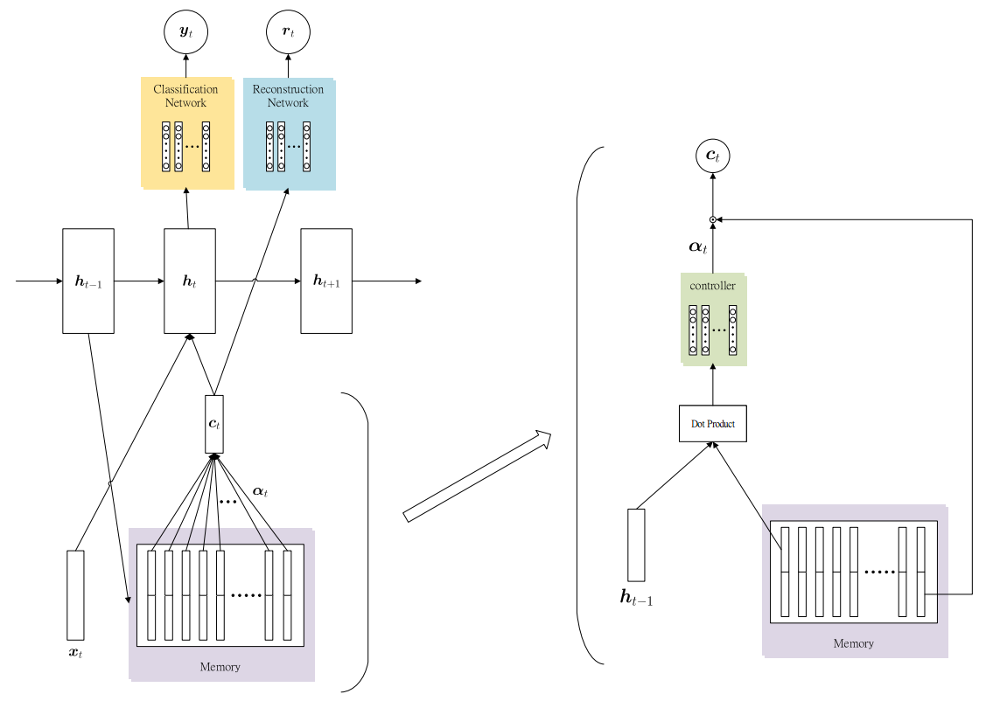
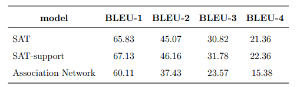

# Deep Supporting Attention in Memory Network for Image Caption
In this project, we introduce Supporting Attention into Memory Network.
We evalute this model on MS-COCO Caption dataset

## Setting 
- Hardware:
    - RAM: DDR3-1600 64G
    - GPU: NVIDIA GTX 1080ti 11G

- Tensorflow: 1.2

- Dataset:
    - MS-COCO Caption: http://cocodataset.org/#captions-challenge2015

## Result
- BLEU scores 

- Example

