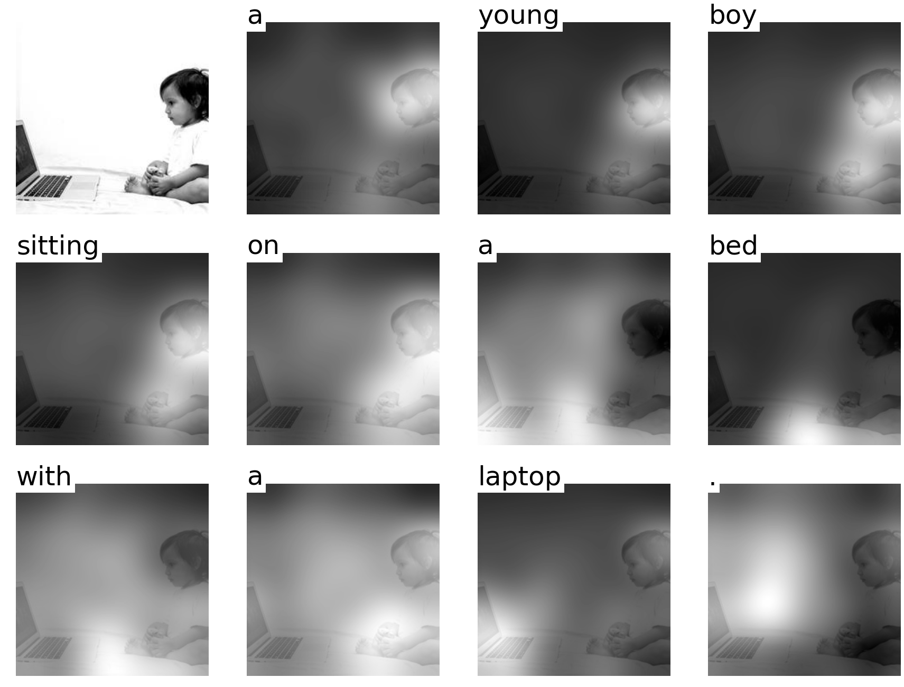

# Deep Supporting Attention in Memory Network for Image Caption
In this project, we introduce Supporting Attention into Memory Network.
We evalute this model on MS-COCO Caption dataset

## Result

## Reference
Another tensorflow implementation: https://github.com/yunjey/show-attend-and-tell

